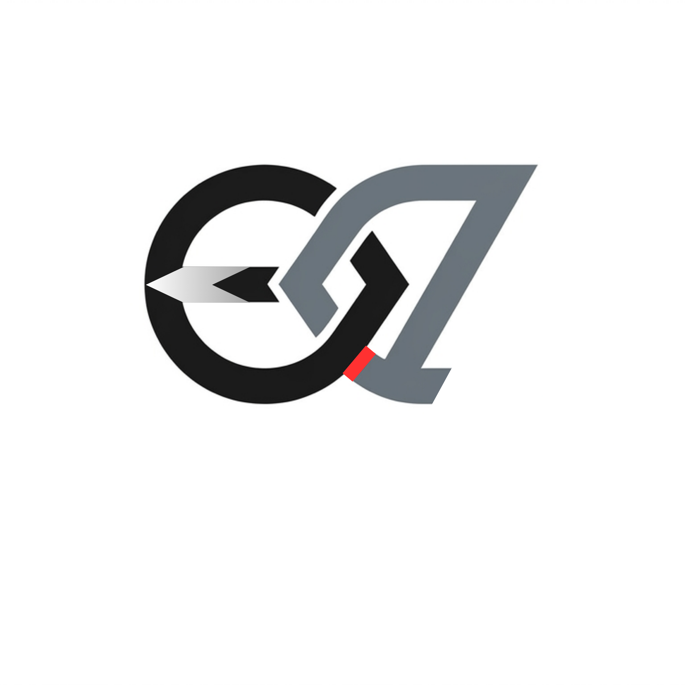

<div align="center">



# Eqovely

**Bridging the resource gap, one transfer at a time.**

A nonprofit platform connecting people and organizations with surplus resources — from medical supplies to educational materials — to the schools, clinics, and individuals who need them most.

*Currently in active development.*

</div>

---

## Why I built this

I've watched the same problem play out in different forms: a school with broken equipment sitting two miles from a company throwing out the exact same equipment. A clinic short on supplies while a warehouse across town has a surplus expiring on a shelf. The resources already exist — they're just not connected to the people who need them.

Eqovely is my attempt to close that gap. Not with donations in the traditional sense, but with a structured, verified system for redistributing surplus — matching donors with recipients based on category, region, and need, and giving both sides a secure, accountable way to complete the handoff.

I'm building this because I believe access to basic resources shouldn't be limited by geography or luck, and because a well-designed piece of software can actually make a dent in that problem.

— Younus Hassen Abdulkadir

---

## What it does

- **Donors** — individuals, companies, and labs — list surplus items: electronics, furniture, medical supplies, office equipment, food, clothing, books, and more.
- **Recipients** — schools, nonprofits, clinics, and individuals — browse listings by category and region, and claim what they need.
- Every claim generates a private **6-digit verification PIN**, exchanged only between donor and recipient, so nothing is marked as transferred until both sides confirm it in person.
- Built-in **real-time messaging** lets donors and recipients coordinate pickup directly on the platform.
- An **impact dashboard** tracks listings posted, items claimed, and units transferred — visible to each user for their own activity.

## A few technical decisions I'm proud of

**Row Level Security on every table.** Rather than relying on the frontend to decide what a user can see, every database table enforces access control at the database layer — a user can only ever read their own messages, claim their own items, or edit their own listings, regardless of what the client sends.

**The PIN handshake system.** Physical handoffs are the riskiest part of any resource-sharing platform — there's no way to verify a transfer happened without some kind of confirmation from both sides. I designed a two-key verification flow: the recipient gets a cryptographically random 6-digit PIN on claim, and the donor enters it at pickup to confirm the transfer. Neither side can fake it, and it only exists between the two parties involved.

**Accessibility as a first-class requirement, not an afterthought.** Focus traps on every modal, ARIA live regions for toast notifications, keyboard navigation throughout, and WCAG-conscious color contrast — because a platform meant to serve schools and clinics needs to actually be usable by everyone, including screen reader users.

**GDPR-conscious from day one.** Users can export all their data or permanently delete their account, and the privacy policy is written in plain language rather than buried legal boilerplate.

## Tech stack

| | |
|---|---|
| **Frontend** | React 19, Vite, Tailwind CSS |
| **Backend** | Supabase (PostgreSQL, Auth, Realtime, Storage) |
| **Security** | Row Level Security policies, cryptographic PIN generation, HTML sanitization |
| **Deployment** | *(TBD)* |

## Project status

Eqovely is **pre-launch** and under active development. Core functionality — listings, claiming, messaging, the PIN transfer system, authentication, and the impact dashboard — is built and working. Remaining work before launch includes final QA, a real admin moderation panel, and connecting a custom domain for reliable email delivery.

I'm building this in the open and iterating quickly. If you're reading this before launch, you're early.

## Roadmap

- [x] Core marketplace — listing, browsing, claiming
- [x] Row Level Security across all data
- [x] Real-time messaging between donors and recipients
- [x] 6-digit cryptographic PIN transfer verification
- [x] Password reset, email confirmation, account deletion (GDPR)
- [x] Accessibility pass — focus traps, ARIA live regions, keyboard navigation
- [ ] Admin moderation dashboard
- [ ] Automated test coverage for the claim → transfer flow
- [ ] Custom domain + transactional email
- [ ] Multi-language support
- [ ] Public launch

## Getting started

```bash
git clone https://github.com/<your-username>/eqovely.git
cd eqovely
npm install
npm run dev
```

You'll need a Supabase project with the schema and Row Level Security policies configured — see `/docs` *(coming soon)* for setup details.

## Founder

**Younus Hassen Abdulkadir**
Building Eqovely to make surplus resources reach the people who need them — no matter where they are.

---

<div align="center">
<sub>Built with the belief that access to resources shouldn't depend on geography.</sub>
</div>
